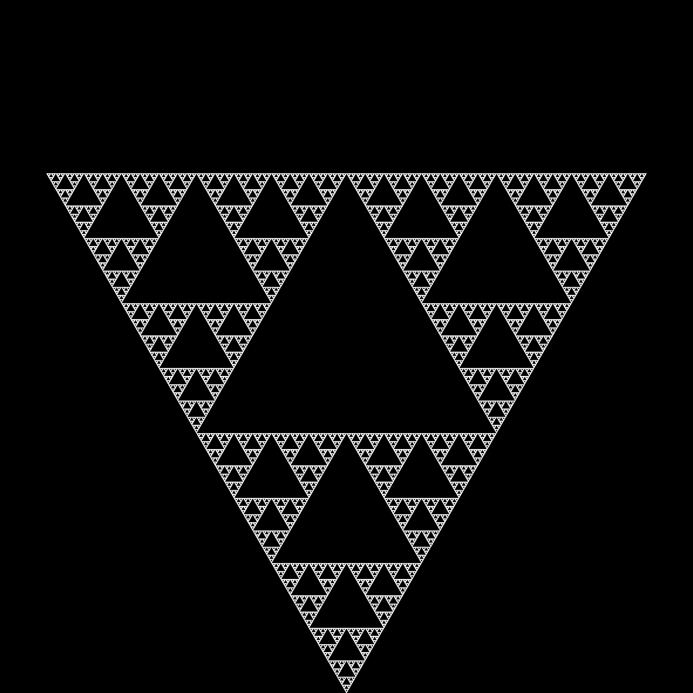
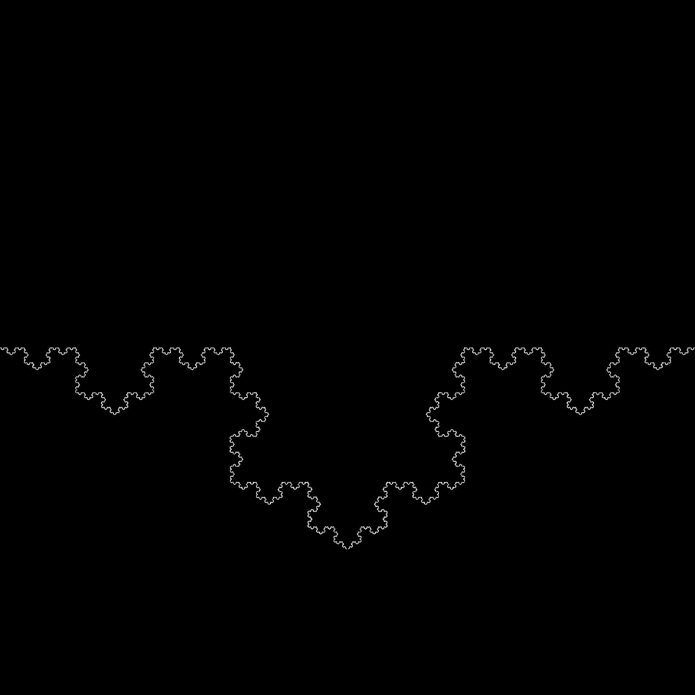
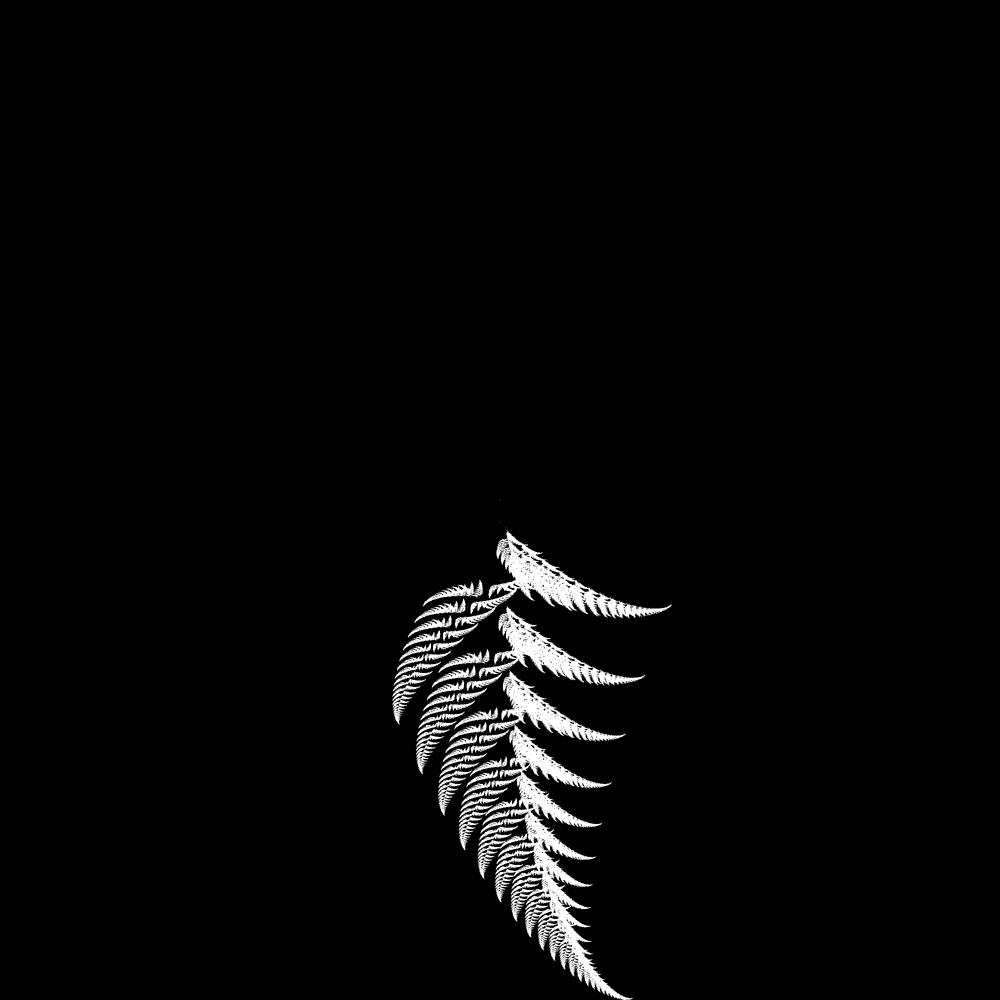
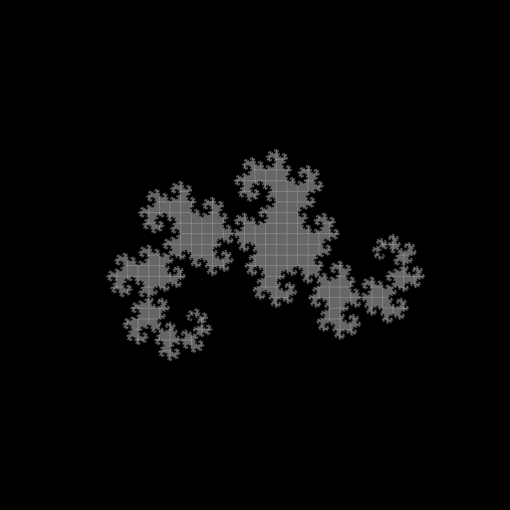
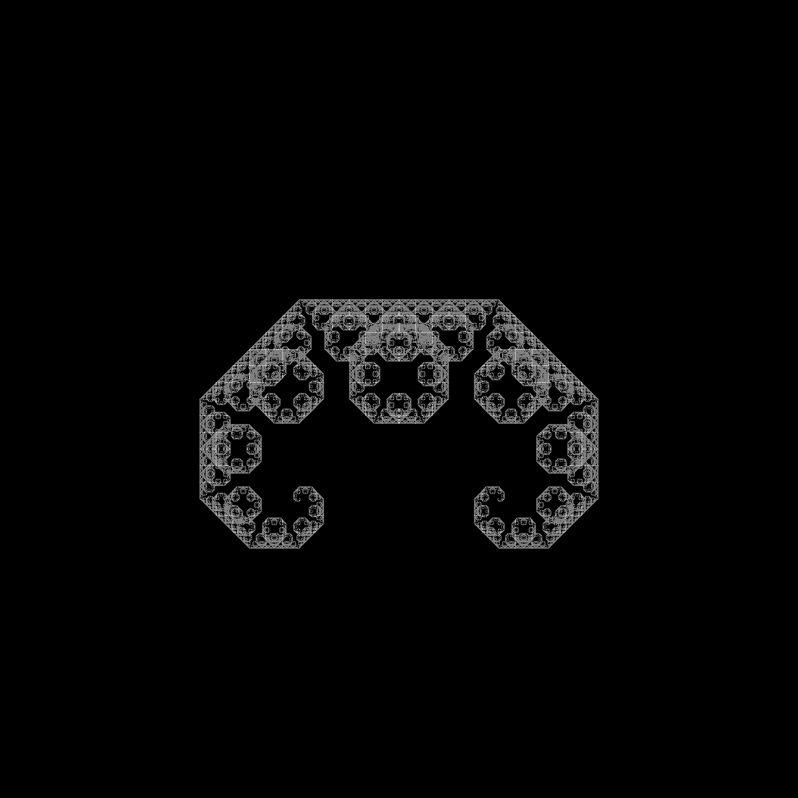
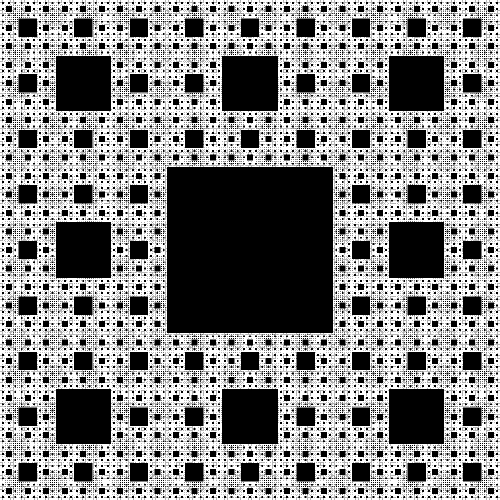
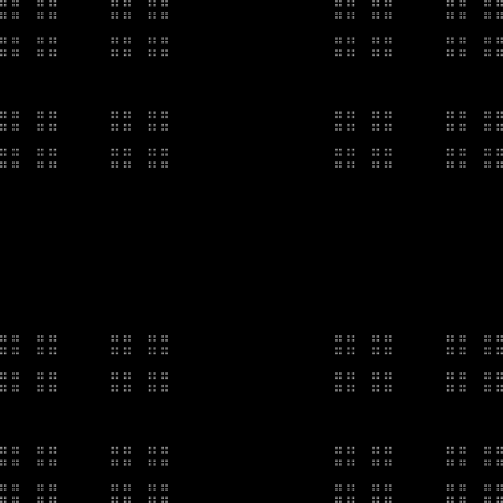
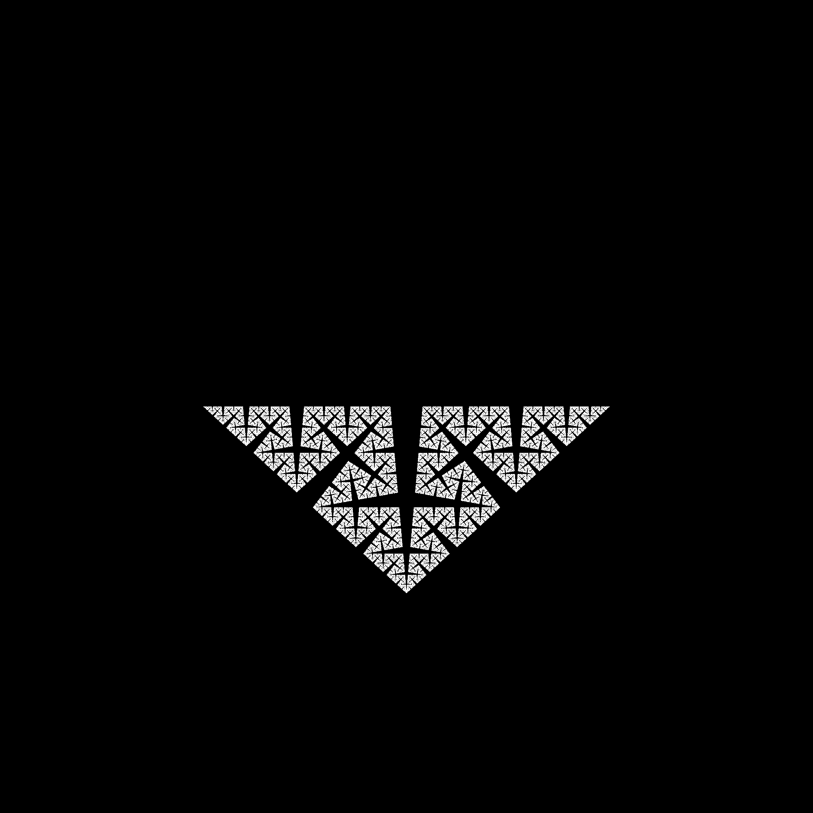
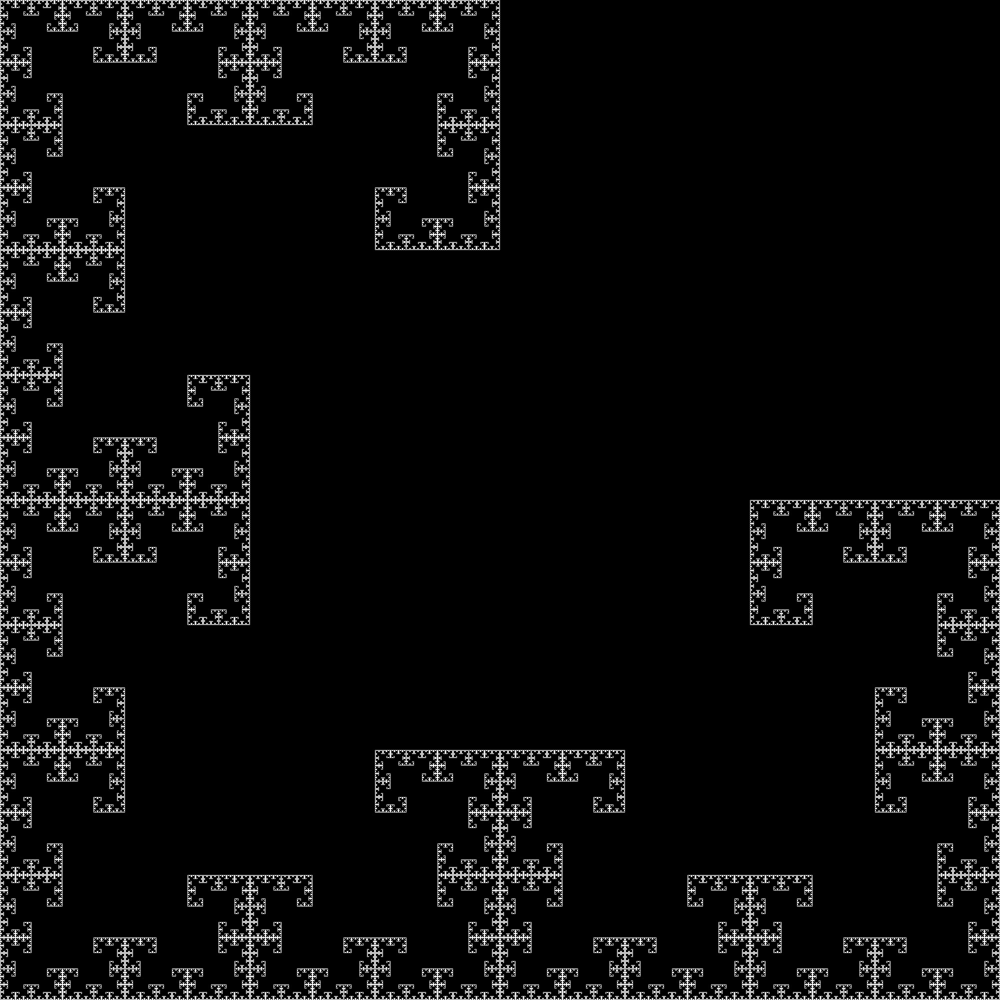

# fractal-generator

This program generates fractals using an [Iterated Function System](https://en.wikipedia.org/wiki/Iterated_function_system).

To make a fractal, simply specify the transformations using a list of `(transformation matrix, translation vector)` tuples. Some examples are included.

Some fractals generated with this program:

